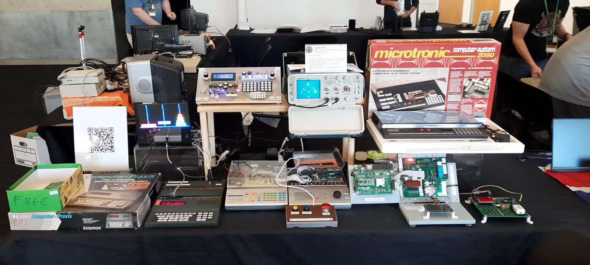
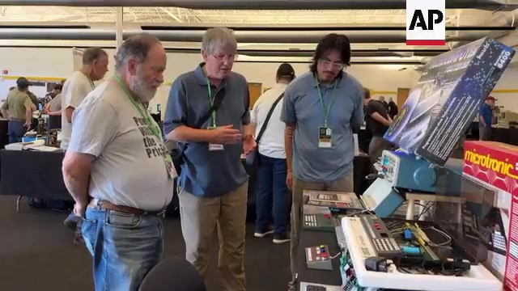

# VCF West 2026 — German Educational Computers of the 1980s

Exhibit material for the **Vintage Computer Festival West 2026** display of three
1980s German educational computers:

- **Busch Microtronic 2090** (1981) — a 4-bit, hex-keypad single-board trainer
- **Kosmos CP1** (1983) — an experimenter's microcomputer
- **Philips MasterLab MC6400** (1983) — an INS8070 (SC/MP III) CPU trainer

**🌐 Live site: https://lambdamikel.github.io/vcf-west-2026/**

## 🎉 VCF West 2026 — Aftermath

**VCF West 2026 was a lot of fun — here are my highlights.**
*August 2026 · Computer History Museum, Mountain View, California.*

The whole setup — the Tektronix scope drawing the rotating vector cube, the Busch Microtronic
and Kosmos CP1 boxes, the *Vector Invaders* controller, and the family of emulator builds:



Michael Wessel with **Jose Corral** and **Leonard Tramiel** at the table — a still from
*"Silicon Valley celebrates its past at Vintage Computer Festival,"* © AP Archive
([youtu.be/yubh3oMjUns](https://youtu.be/yubh3oMjUns?t=19)):



- **Allan Alcorn stopped by.** Atari co-founder **Allan Alcorn** — the engineer behind the
  original *PONG* — was taken with the Vector Invaders shooter on the oscilloscope, and talked
  through how the 1972 *PONG* was built entirely from discrete hardware logic, with no
  microprocessor and no software at all. His compliment:

  > "You made an oscilloscope do something that it is not supposed to do — like I did back in the day with PONG!"
  > — **Allan Alcorn**, on the Vector Invaders shooter

- **Leonard Tramiel & the Lectron kits.** **Leonard Tramiel** shared that he first learned
  electronics as a kid from the **Braun Lectron** magnetic building-block kits — a full-circle
  moment beside a table of 1980s German educational computers.

🎥 **Videos:** [the moment, AP Archive coverage](https://youtu.be/yubh3oMjUns?t=19) ·
[walk my table (my video)](https://youtu.be/QwauecMYTC4)

## 📖 Background reading — in English

These machines were born in 1980s Germany, so their manuals and the articles about them
are German. Two English translations tell the whole story:

- **★ Start here — [German Educational Computers of the 1980s](https://github.com/lambdamikel/german-educational-computers-of-the-80s)**
  — the all-in-one English edition of the LOAD-magazine articles covering all three machines,
  with a speed benchmark, modern developments and the Microtronic Phoenix.
- **[English Busch Microtronic Manuals](https://github.com/lambdamikel/microtronic-2090-manuals-english)**
  — an English translation of the original Microtronic 2090 manual (web + PDF; hosted by
  permission of Jörg Vallen / Busch GmbH &amp; Co. KG).

## QR codes

Scan (or print for the exhibit table):

| Live site (posters & material) | This GitHub repo |
|:---:|:---:|
|  |  |
| `lambdamikel.github.io/vcf-west-2026` | `github.com/lambdamikel/vcf-west-2026` |

Print-quality files are in [`qr/`](qr/) — 1080 px PNGs and scalable SVGs.

## What's here

```
index.html      landing page (poster gallery)
posters/        A3 exhibit posters + kids' handout — HTML (live) and PDF (print)
adverts/        original scanned period adverts for the three machines (PDF)
thumbs/         gallery preview images
qr/             QR codes for the live site and this repo (PNG + SVG, print quality)
media/          post-show photos (aftermath section)
```

### Posters (A3)

| Poster | Machine | |
|---|---|---|
| MasterLab — 3-D vector graphics in 1 KB | Philips MC6400 | [HTML](posters/VCF2026_MasterLab_poster.html) · [PDF](posters/VCF2026_MasterLab_poster.pdf) |
| The 1981 4-bit trainer | Busch Microtronic 2090 | [HTML](posters/VCF2026_Microtronic_poster.html) · [PDF](posters/VCF2026_Microtronic_poster.pdf) |
| A ten-year emulation journey | Busch Microtronic 2090 | [HTML](posters/VCF2026_Microtronic_Emulators_poster.html) · [PDF](posters/VCF2026_Microtronic_Emulators_poster.pdf) |
| Towers of Hanoi | Kosmos CP1 | [HTML](posters/VCF2026_CP1_Hanoi_poster.html) · [PDF](posters/VCF2026_CP1_Hanoi_poster.pdf) |
| Head to head (comparison) | all three | [HTML](posters/VCF2026_Comparison_poster.html) · [PDF](posters/VCF2026_Comparison_poster.pdf) |

### Kids' handout (US Letter)

A friendly take-home one-pager — binary, hex, and your first machine-code program.
[HTML](posters/VCF2026_Microtronic_Kids_Handout.html) · [PDF](posters/VCF2026_Microtronic_Kids_Handout.pdf)

> The contact email on the handout is obfuscated in the web (HTML) version to keep
> spam-bots away; the printable **PDF** carries the real address.

### Original period adverts

- [Busch Microtronic 2090 (1981)](adverts/1981-microtronic.pdf)
- [Kosmos CP1](adverts/CP1.pdf)
- [Philips MasterLab MC6400](adverts/masterlab.pdf)

## Printing

Posters are laid out **A3 portrait**; print the PDFs at 100% (A3), or scale to
12×18 / 13×19 in. The handout is US Letter.

## The projects behind the exhibit

- [Busch-2090](https://github.com/lambdamikel/Busch-2090) — the main Microtronic repo:
  emulators (Arduino Uno / Mega), classic program library, docs
- [Microtronic Phoenix](https://github.com/lambdamikel/microtronic-phoenix) — the
  modern Microtronic re-implementation
- [PicoRAM 2090](https://github.com/lambdamikel/picoram2090) — a Raspberry Pi Pico
  (RP2040) 2114-SRAM emulator + SD-card storage for the Busch Microtronic
- [PicoRAM Ultimate](https://github.com/lambdamikel/picoram-ultimate) — the
  general-purpose SRAM emulator & SD-card interface for vintage single-board computers
- [Claude-written ("vibe-coded") Microtronic programs](https://github.com/lambdamikel/picoram2090/tree/main/software/vibe-coded)
  — new games and demos for the Microtronic + PicoRAM 2090, written by Claude
- [Philips MC6400 vector graphics](https://github.com/lambdamikel/philips-mc6400-vector-graphics)
  — 3-D wireframe cube & vector shooter on an X-Y scope, in 1 KB

For English-language background on the machines themselves, see
[📖 Background reading](#-background-reading--in-english) near the top.

---

Exhibit & hardware by **Michael Wessel**. Posters and info material free to view,
print and share.
